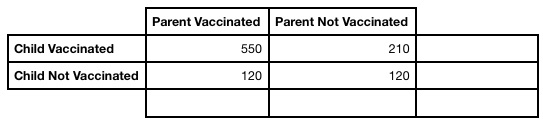
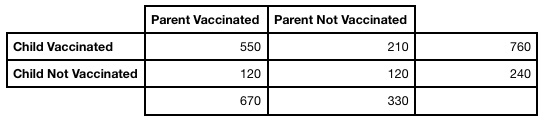
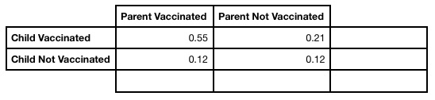
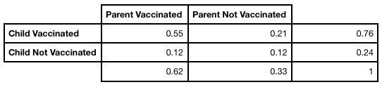

```{r setup, include=FALSE}
knitr::opts_chunk$set(echo = FALSE)
options(width = 300)
```

## Review Topics

- Terminology
- Probability
- Common Issues
- More R Coding

## Different Kinds of Models

- Classification:
- The target feature is categorical.
- Regression:
- The target feature is numeric.
- Clustering:
- Groups datapoints into clusters.
- Supervised:
- Training data is labeled.
- Un-Supervised: 
- The training data is not labled.

## More Terminology

- Underfitting:
- When the model is not flexible enough to fit the data well.
- Overfitting:
- When the model fits the training data too well to fit the test data well.
- Model Flexibility:
- How well the model fits the training data, a model can be too flexible or too rigid.
- Which one leads to overfitting?

## Even More Terminology

- Vectorized Operation:
- When an operation is performed on every element in a vector.
- What are some examples?
- Aggregate functions:
- When a function takes a vector, and returns one value.
- Is that value a vector?
- Yes, there are no such things as scalers in R.

## Probability Tables {.build}

```{r, error = TRUE, echo = TRUE}
# What does this table signify?
```
```{r, error = TRUE, out.width = "800px"}

```
```{r, error = TRUE, echo = TRUE}
# Next, lets put in the totals for children.
```

## Probability Tables {.build}

```{r, error = TRUE, out.width = "800px"}
knitr::include_graphics("images/probTable2.jpg")
```
```{r, error = TRUE, echo = TRUE}
# Next, lets put in the totals for parents
```

## Probability Tables {.build}

```{r, error = TRUE, out.width = "800px"}

```
```{r, error = TRUE, echo = TRUE}
# Lets put in the total number of datapoints
```

## Probability Tables {.build}

```{r, error = TRUE, out.width = "800px"}
knitr::include_graphics("images/probTable4.jpg")
```
```{r, error = TRUE, echo = TRUE}
# Next, we can convert to probabilities.
# What will they be?
```

## Probability Tables {.build}

```{r, error = TRUE, out.width = "800px"}

```
```{r, error = TRUE, echo = TRUE}
# What about the probabilities for each feature?
```

## Probability Tables {.build}

```{r, error = TRUE, out.width = "800px"}

```
```{r, error = TRUE, echo = TRUE}
# Probability tables are very useful for looking at conditional probability.
```

## Coin Flip Problem {.build}

```{r, echo = TRUE, error = TRUE}
# How many possible possible outcomes if you flip 1 coin?
2**1
# H-T, T-H

# How many possible possible outcomes if you flip 2 coins?
2**2
# H-H, T-T, T-H, H-T
```

## Coin Flip Problem {.build}

```{r, echo = TRUE, error = TRUE}

# Three coins?
2**3
# H-H-H, H-H-T, H-T-H, H-T-T
# T-H-H, T-H-T, T-T-H, T-T-T

# X coins?
x = 100
2**x

# How would that change if we were flipping 100 die?
```

## Coin Flip Problem {.build}

```{r, echo = TRUE, error = TRUE}
# If we flip 3 coins what is the probability of exactly two 
# heads, given the last flip is heads?
2**3

# What does this code do?
dat = as.data.frame(replicate(1000, replicate(3, sample(0:1, 1))))
space = dat[,dat[3,] == 1]
mean(apply(space, 2, FUN = function(x) { sum(x) == 2 }))
```

## Expectation Problem - The Setup {.build}

```{r, echo = TRUE, error = TRUE}
# What is the expected value of the sum of a 2 sided and a 4 sided die?

# First, what are the possible sums?
# 1+1, 2+1, 3+1, 4+1, 1+2, 2+2, 3+2, 4+2
# 2,   3,   4,   5,   3,   4,   5,   6
outcome = 2:6
outcome

# What is the probability for each?
# 2 - 1/8
# 3 - 2/8
# 4 - 2/8
# 5 - 2/8
# 6 - 1/8
probs = c(1/8,1/4,1/4,1/4,1/8)
```

## Expectation Problem - Calculating {.build}

```{r, echo = TRUE, error = TRUE}
# How would we calculate the expectation?
exp = sum(outcome*probs)
exp

# Does that seem realistic?
# What's the variance?
var = sum(probs*((outcome-exp)^2))
var

# What's the standard deviation?
sqrt(var)
```

## Expectation Problem - Possible Confusion {.build}

```{r, echo = TRUE, error = TRUE}
# Using mean vs using weighted mean and probabilities
# when calculating the variance

out = c(1, 4, 5, 5, 4, 4, 4)
mean((out-mean(out))^2)

uniq = c(1, 4, 5)
probs = c(1/7, 4/7, 2/7)
exp = sum(uniq*probs)
sum(((uniq-exp)^2)*probs)

# These are the same!
```

## Common Issues - Creating Vectors {.build}

```{r, error = TRUE, echo = TRUE}
# These two expressions create same thing...
x = 1:10
y = c(1:10)

identical(x, y)

# ...but the first way of doing it is much better!

# Why did I check them using identical() rather than == ?
y == x
```

## Common Issues - Using replicate() {.build}

```{r, error = TRUE, echo = TRUE}
# What do these lines do?
x = mean(sample(1:10, 5))
replicate(10, x)

# How is this different?
replicate(10, mean(sample(1:10, 5)))
```

## Common Issues - Using replicate() {.build}

```{r, error = TRUE, echo = TRUE, fig.width = 7, fig.height = 3}
# Here's a function
test = function(x) {
  return(sample(x, 1))
}

# Can functions be used in replicate?
replicate(10, test(1:10))
```

## Common Issues - Using ifelse() {.build}

```{r, error = TRUE, echo = TRUE, fig.width = 7, fig.height = 3}
# What is the result of this expression?
x = 1:10
ifelse(x <= 5, 0, 1)

# Writing the same with a boolean vector
bool_vel = c(TRUE, TRUE, TRUE, TRUE, TRUE, FALSE, FALSE, FALSE, FALSE, FALSE)
ifelse(bool_vel, 0, 1)
```

## Common Issues - Using runif() {.build}

```{r, error = TRUE, echo = TRUE, fig.width = 7, fig.height = 3}
# What's the value of r?
r = runif(1000)
head(r)

# runif(n) generates n random numbers between 0 and 1

# What is the value of this expression?
mean(r)
```

## Common Issues - Combining Functions {.build}

```{r, error = TRUE, echo = TRUE, fig.width = 7, fig.height = 3}
# What's the value of r?
r = runif(200)+0.9
head(r)

# What is the result of this expression?
head(floor(runif(200)+0.9), 40)

# Now, let's replicate it!
prob = replicate(100, mean(floor(runif(200)+0.9)))
head(prob, 10)
```

## Common Issues - Working with Strings {.build}

```{r, error = TRUE, echo = TRUE, fig.width = 7, fig.height = 3}
# Does this concatenate?
c("Two", "Strings")

# Nope! Althogh c() can stand for "combine", it just creates a vector

# So how would I do that?
```

## Common Issues - Working with Strings

```{r, error = TRUE, echo = TRUE, fig.width = 7, fig.height = 3}
# Does this concatenate?
c("Two", "Strings")

# Nope! Althogh c() can stand for "combine", it just creates a vector

# So how would I do that?
paste("With", "spacing")
paste0("No", "spacing")
```

## Common Issues - Working with Strings {.build}

```{r, error = TRUE, echo = TRUE, fig.width = 7, fig.height = 3}
# Finding the length of a string

# How would I find the number of characters?
nchar("The quick brown fox jumps over the lazy dog")
length("The quick brown fox jumps over the lazy dog")

# length() is used to count the number of elements in a vector
# nchar() is used to count the number of characters in a string

# ncol() and nrow() can be used on data frames
```

## Common Issues - Working with Strings

```{r, error = TRUE, echo = TRUE, fig.width = 7, fig.height = 3}
# Finding the length of a string

# How would I find the number of characters?
nchar("The quick brown fox jumps over the lazy dog")
length("The quick brown fox jumps over the lazy dog")

# length() is used to count the number of elements in a vector
# nchar() is used to count the number of characters in a string

# ncol() and nrow() can be used on data frames
```
## Sequences {.build}

```{r, error = TRUE, echo = TRUE }
# What is the output of this sequence?
seq(0, 500, 100)
```

## Data Frames {.build}

```{r, error = TRUE, echo = TRUE }
# Create a data frame with a column of numbers 1 to 10
# and a column of letters a to j
```

## Data Frames

```{r, error = TRUE, echo = TRUE }
# Create a data frame with a column of numbers 1 to 10
# and a column of letters a to j

dat = data.frame(1:10, letters[seq(1,10)])
names(dat) = c("Number","Letter")
dat
```

## Data Frames {.build}

```{r, error = TRUE, echo = TRUE }
# Give me a vector of letters, where the matching number is > 5
```

## Data Frames

```{r, error = TRUE, echo = TRUE }
# Give me a vector of letters, where the matching number is > 5

as.vector(dat$Letter[dat$Number > 5])
as.vector(dat[dat$Number > 5,]$Letter)
```

# Questions?

