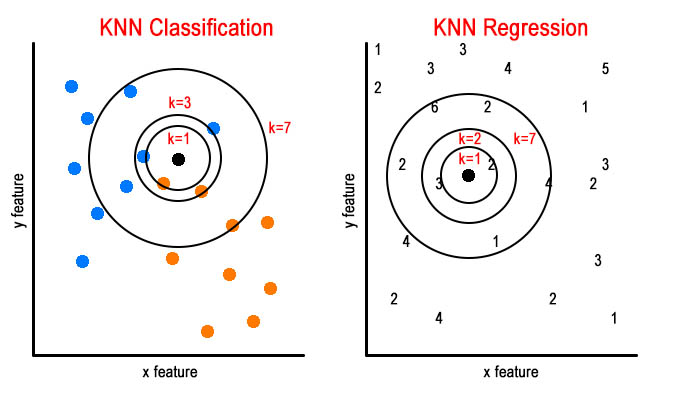

```{r setup, include=FALSE}
knitr::opts_chunk$set(echo=FALSE)
options(width=300)
```

## Review Topics

- Data Exploration
- Data Cleaning and Preprocessing
- KNN
- Linear Regression
- Logistic Regression
- R Code

## Introduction

This review session was originally presented as a Jeopardy-ish style game, with questions worth a different number of points and teams of 3 answering them. Correct answers were followed by a more in depth explanation, and when there were incorrect answers other teams were allowed to correct it. Each of the six review topics on the previous slide has 7 questions associated with it, for a total of 42 game questions. The link to the game is here: LINK though it may not be permanently available.

# Data Exploration

## Data Exploration - Q1:

Write R code to import a CSV file and store it as the variable `dat`.

## Data Exploration - A1:

```{r, error=TRUE, echo=TRUE}
dat=read.csv("../../data/titanic.csv")
```

## Data Exploration - Q2:

Create a histgram of `mpg` values using the `mtcars` data. Add a title, and a clean x axis label.

## Data Exploration - A2:

```{r, error=TRUE, echo=TRUE}
hist(mtcars$mpg, main="Histogram of MPG Values", xlab="MPG")
```

## Data Exploration - Q3:

Create a bar plot of mean `mpg` grouped `cyl` number, for the `mtcars` data.

## Data Exploration - A3:

```{r, error=TRUE, echo=TRUE }
data=aggregate(mpg ~ cyl, data=mtcars, mean)
barplot(data$mpg, names.arg=data$cyl, main="Mean MPG for Each Number of Cylinders", 
        xlab="Cylinders", ylab="Mean MPG")
```

## Data Exploration - Q4:

Create a scatterplot with the `disp` on the x axis, and the `mpg` on the y axis using the `mtcars` data. There are of course, multiple ways to do this, so do it in 2 different ways. Arrange these identical plots side by side.

## Data Exploration - A4:

```{r, error=TRUE, echo=TRUE, fig.height=3, fig.width=10}
par(mfrow=c(1,2))
plot(mtcars$disp, mtcars$mpg, main="Engine Displacement and MPG", 
     xlab="Displacement", ylab="MPG")
plot(mpg ~ disp, data=mtcars, main="Engine Displacement and MPG", 
     xlab="Displacement", ylab="MPG")
```

## Data Exploration - Q5:

Create a density plot of the `mpg` data from `mtcars`. Add a title and x label.

## Data Exploration - A5:

```{r, error=TRUE, echo=TRUE }
plot(density(mtcars$mpg), main="Density of MPG Values", xlab="MPG")
```

## Data Exploration - Q6:

Create a double density plot, a blue line for the `mpg` of automatic cars, where

`am=0`, and a red line for manual cars, where `am=1`.

## Data Exploration - A6:

```{r, error=TRUE, echo=TRUE }
plot(density(mtcars[mtcars$am == 0,]$mpg), main="Density of MPG Values", 
     xlab="MPG", col="blue", xlim=c(0, 45))
lines(density(mtcars[mtcars$am == 1,]$mpg), col="red")
```

## Data Exploration - Q7:

Create a side by side bar plot using any of the columns in `mtcars`.

## Data Exploration - A7:

```{r, error=TRUE, echo=TRUE, fig.height=3, fig.width=10}
colors=c("red","orange","yellow")
barplot(table(mtcars$cyl, mtcars$gear), beside=TRUE, ylab="Number of Cars", 
        xlab="Gears", col=colors, main="Number of Cars by Gear and Cylinder")
legend("topright", title="Cylinders", legend=sort(unique(mtcars$cyl)), fill=colors)
```

# Data Cleaning and Preprocessing

## Data Cleaning - Q1:

Write R code to count the total number of `NA` values in a data frame, and code to count the `NA` values in each column of the data frame.

## Data Cleaning - A1:

```{r, error=TRUE, echo=TRUE}
dat=read.csv("../../data/titanic.csv")

sum(is.na(dat))

apply(dat, 2, function(x) sum(is.na(x)))
```

## Data Cleaning - Q2:

Give an example of when you would remove entire columns from your dataset, and when you would remove entire rows from your dataset. Would you ever do both?

## Data Cleaning - A2:

If a column has a high percentage of `NA` values you may want to remove the column, rather than all the rows. This is because if you have a problematic column and remove all rows effected by it, you may be losing a lot of values that are not `NA`, but if you remove the majority `NA` column then you're mostly just removing `NA` values.

## Data Cleaning - Q3:

Why does this R code return NA rather than the mean age? Re-write the code to avoid the issue.

```{r, error=TRUE, echo=TRUE}
mean(read.csv("../../data/titanic.csv")$Age)
```

## Data Cleaning - A3:

It's happening because arithmetic operations return `NA` when there is an `NA` value in what's being operated on.

```{r, error=TRUE, echo=TRUE}
mean(read.csv("../../data/titanic.csv")$Age, na.rm=TRUE)
```

## Data Cleaning - Q4:

Given a vector `vec` write R code to scale it using unit interval scaling. 

## Data Cleaning - A4:

In unit interval scaling the minimum value becomes zero, and the maximum value becomes one. 

```{r, error=TRUE, echo=TRUE}
vec=sample(0:100, 50)
scaled=(vec - min(vec)) / (max(vec) - min(vec))
head(scaled, 7)
min(scaled)
max(scaled)
```

## Data Cleaning - Q5:

Given a vector `vec` write R code to scale it using z-scaling, and explain how you'd create your own function to do the same.

## Data Cleaning - A5:

```{r, error=TRUE, echo=TRUE}
vec=sample(0:100, 50)

scaled=scale(vec)
c(mean(scaled), sd(scaled))

scaled_manually=(vec - mean(vec)) / sd(vec)
c(mean(scaled_manually), sd(scaled_manually))
```

## Data Cleaning - Q6:

If we have a categorical value, height, with three possible labels (short, medium and tall), how many numerical features would be needed to contain the same information? Give examples of what they could be.

## Data Cleaning - A6:

Two numerical features would be needed. One could be `is.short` and the other could be `is.medium`. A `0` would indicate `FALSE` and a `1` a `TRUE`. If both are `0`, then that would mean the individual is neither short nor medium, and is therefore tall. So, to generalize, we need n - 1 numerical features to convert a categorical feature with n possible categories.

## Data Cleaning - Q7:

In the following three plots, estimate the p correlation value:

```{r, error=TRUE, echo=FALSE}
par(mfrow=c(1,3))
plot(c(1,5,7,9),c(2,4,6,9), xlab="X", ylab="Y", main="Plot 1")
plot(c(1,5,7,2,4),c(1,1,2,7,3), xlab="X", ylab="Y", main="Plot 2")
plot(c(9,6,4,2),c(1,5,7,9), xlab="X", ylab="Y", main="Plot 3")
```

## Data Cleaning - A7:

This can be subjective, but to me *Plot 1* looks like it has a pretty strong positive correlation, so p is close to 1. *Plot 2* looks like it has no trend at all, so p=0 and *Plot 3* looks like a strong downward trend, so p is close to -1.

# KNN

## KNN - Q1:

KNN is used for:

A) Classification

B) Regression

C) Both A and B

D) Anomaly detection

E) All of the above

## KNN - A1:

KNN can be used for classification, by looking at the label of the K nearest neighbors, regression by taking the mean of the KNN, and anomaly detection by looking at the distance between a point and the mean of the KNN or the absolute distance of the K nearest neighbor 

## KNN - Q2:

Using the left side of the image below, what is the class of the black dot when `k=3`, and what is it when `k=7`? How did you come up with your answer?

```{r, error=TRUE, out.width="800px"}

```

## KNN - A2:

```{r, error=TRUE, out.height="300px"}

```

There are 2 orange and 1 blue when `k=3`, which would make the black belong to class orange.

For `k=7` there are 4 blue, and 3 orange, meaning the black would be predicted to be blue.

In KNN classification we take the most frequent label.

## KNN - Q3:

Using the right side of the image, what would the value of the black dot be if `k=1`? What if `k=2`? How did you come up with your answer?

```{r, error=TRUE, out.width="800px"}

```

## KNN - A3:

```{r, error=TRUE, out.height="300px"}

```

There's just one NN when `k=1` and that neighbor is `2`.

When `k=2` the 2 nearest neighbors are `2` and `3`. We take the mean of those, and get `2.5`.

In KNN regression we take the mean of the values of the k nearest neighbors.

## KNN - Q4:

True or False: when making a prediction using KNN, we need to remember all the training data. Why?

## KNN - A4:

This is true. When making a prediction we need to calculate the distance from the new point, to all the other points in order to find the k nearest points. This means we have to remember all the training points.

## KNN - Q5:

Write an R function to calculate the distance between two points. The function should take the parameters `x1`, `y1`, `x2`, `y2` and `manhattan`, which is a boolean value. If `manhattan` is *TRUE*, your function should calculate the *manhattan* distance, otherwise it should calculate the *euclidian* distance. By default, the `manhattan` parameter should be *FALSE*.

## KNN - A5:

```{r, error=TRUE, echo=TRUE}
dist=function(x1, y1, x2, y2, manhattan=FALSE) {
  if (manhattan) {
    return (abs(x2-x1) + abs(y2-y1))
  }
  else {
    return (sqrt((x2-x1)^2 + (y2-y1)^2))
  }
}
dist(0,0,1,1)
dist(0,0,1,1,TRUE)
```

## KNN - Q6:

True or False: whether or not you scale your data makes a big difference when using KNN. Explain why.

## KNN - A6:

Whether or not you scale your data makes a huge difference when using KNN.

If the units on one axis are much bigger than the other, then that feature will be more significant when it comes to a KNN model. If, for example, all our data lies on one vertical line, then only the Y axis feature will be used to determine the K nearest neighbors.

## KNN - Q7:

By increasing k in a KNN model, you are:

A) Decreasing the chance of overfitting

B) Increasing the chance of overfitting

Why?

## KNN - A7:

As the k of your KNN model grows, the prediction becomes less influenced by its immediate neighbors. So, as k increases, you are less likely to be overfitting your model. However, if k is too big you may be start to have underfitting.

# Linear Regression

## Linear Regression - Q1:

What are the parameters of a linear regression model?

## Linear Regression - A1:

The parameters for a linear regression model are the coefficients of the line. The equation of a line is: 

`y=mx + b`  

Where the m is the slope and b is the intercept. If we have multiple inputs:  

`Y=β0 + β1X1 + β2X2 + ... + βnXn`  

This one equation is enough to take the input and calculate the output of the model.  

## Linear Regression - Q2:

How is a linear regression model trained?

## Linear Regression - A2:

The model is created by tuning the coefficients until the error of the residuals is minimized.

## Linear Regression - Q3:

Create a linear model in R, to predict `mpg` using `disp` using the `mtcars` data.

Plot the data using a scatterplot, and add the line from the model.

## Linear Regression - A3:

```{r, error=TRUE, echo=TRUE}
fit=lm(mpg ~ disp, data=mtcars)
plot(mpg ~ disp, data=mtcars, main="MPG by Displacement")
abline(fit)
```

## Linear Regression - Q4:

What is MSE and what is it used for?

## Linear Regression - A4:

MSE stands for "Mean Squared Error" and is the average of each residual value squared.

## Linear Regression - Q5:

What's the difference between RMSE and MSE. Why would you use one over the other?

## Linear Regression - A5:

RMSE is the "Root Mean Squared Error" and is the same as `sqrt(MSE)`

It can give you a more interpretable representation of the error, by providing the error in `units` rather than `units^2`.

## Linear Regression - Q6:

Given a linear model `fit` print the significance of each predictor. Which predictors would you consider removing from the model?

## Linear Regression - A6:

```{r, error=TRUE, echo=TRUE}
fit=lm(mpg ~ disp + qsec + drat, data=mtcars)
summary(fit)
```

## Linear Regression - Q7:

True or False: To when we predict using a linear model, we need to "remember" all the training data, just like in KNN.

## Linear Regression - A7:

False. When we predict using a linear model, all we need are the coefficients We can use the function of the line to make our predictions without having to remember any training data.

# Logistic Regression

## Logistic Regression - Q1:

Logistic regression is used to predict for:

A) Regression problems

B) Classification problems

## Logistic Regression - A1:

It's used for classification. Logistic regression is a way of using linear regression for classification problems.

## Logistic Regression - Q2:

Write the equation for the logistic curve or "squashing" function, and explain what it means.

## Logistic Regression - A2:

`y=(e^x) / (1 + e^x)`

## Logistic Regression - Q3:

In the logistic function (the "squashing" function), what do we use for the variable x?

## Logistic Regression - A3:

The variable x is the equation of the linear model. For example, if the linear model is: 

`Y=β0 + β1X1 + β2X2`

then x in the logistic equation would be substituted with:

`β0 + β1X1 + β2X2`

## Logistic Regression - Q4:

Write R code to create a logistic regression model to predict `am` (automatic or manual) using all other features of the `mtcars` data.

## Logistic Regression - A4:

```{r, error=TRUE, echo=TRUE}
fit=glm(am ~ . , data=mtcars, family=binomial)
summary(fit)
```

## Logistic Regression - Q5:

Is an RMSE value of 50 low, or is it high? Why?

## Logistic Regression - A5:

More information is needed!

The RMSE value is the Root Mean Squared Error. It's in the same units as the Y axis. For example, if we are trying to predict the age of a person by their height, then an error of 50 years is a very big error, compared to the range of the ages on the Y axis. But, if we're trying to predict the profit a company will make in Q2 of 2019 then an error of $50 is probably not a significant error at all.

## Logistic Regression - Q6:

How is the best possible equation for the logistic regression determined?

## Logistic Regression - A6:

Whereas for linear regression the coefficients were modified till the error was reduced to the smallest error possible, in logistic regression maximum likelihood principal is used. This means the model is adjusted till the probability of getting the results we should be getting is the highest. 

## Logistic Regression - Q7:
  
Once we have the equation for a logistic model, how is it used to make predictions?
  
## Logistic Regression - A7:

A simple way to make predictions using a logistic model is to round the output of the logistic function. This means that if it's 0.5 or higher then round up to 1, and if it's lower round down to 0.

Does the cutoff value always have to be 0.5?
  
# R Code

## R Code - Q1:

Write R code to get every other, alternating, row of the data frame `mtcars`.

## R Code - A1:

```{r, error=TRUE, echo=TRUE}
mtcars[c(TRUE,FALSE),]
```

## R Code - Q2:

Write R code to split `mtcars` into test and training data, with a 70/30 split.

## R Code - A2:

```{r, error=TRUE, echo=TRUE}
tr_rows=sample(nrow(iris), nrow(iris) * 0.7)
tr_dat=iris[tr_rows,]
te_dat=iris[-tr_rows,]

nrow(tr_dat) + nrow(te_dat) == nrow(iris)
```

## R Code - Q3:

Write two lines of R code to summarize the `mtcars` data with built in functions.

## R Code - A3:

```{r, error=TRUE, echo=TRUE}
str(iris)
summary(iris)
```

## R Code - Q4:

Write R code to sample 4 coin flips, 1000 times, and find the probability of the last flip being heads.

## R Code - A4:

```{r, error=TRUE, echo=TRUE}
mean(replicate(1000, sample(0:1, 4, TRUE))[4,])
```

## R Code - Q5:

Write R code to calculate RMSE using the two vectors below:

```{r, error=TRUE, echo=TRUE}
actual=c(5,6,4,3,7,5,5,6)
predicted=c(4,6,3,4,6,4,7,6)
```

## R Code - A5:

```{r, error=TRUE, echo=TRUE}
rmse=sqrt(mean((actual - predicted)^2))
rmse
```

## R Code - Q6:

What is the expected output of this R snippet?

```{r, error=TRUE, echo=TRUE, results="hide"}
sum(rep(sample(0:1, 1), 1000))
```

## R Code - A6:

```{r, error=TRUE, echo=TRUE}
sum(rep(sample(0:1, 1), 1000))
```

It's going to be either 0 or 1000. This is because unlike the function `replicate()` the `rep()` function only evaluates the expression it's repeating one time. So, the result of the sample will be either 1 or 0, and that value will then be repeated 1000 times, adding to either 1000 or to 0.

## R Code - Q7:

Recreate this plot. The colors and labels don't have to match. You've seen it before!

```{r, error=TRUE, echo=FALSE}
weights=seq(0,100,1)/100
get_probs=function(weight) {
  mean(replicate(100000,sum(sample(0:1,10,replace=TRUE,prob=c(1-weight,weight)))) == 8)
}
probs=sapply(weights, function(x) get_probs(x))
plot(weights, probs, col="red", type="b", pch=20, main="Prob. of 8 Heads in 10 Flips, By Weight", xlab="Coin Weight Towards Heads", ylab="Probability of 8 Heads in 10 Flips")
```

## R Code - A7:

```{r, error=TRUE, echo=TRUE, fig.show='hide'}
weights=seq(0,100,1)/100

get_probs=function(weight) {
  mean(replicate(100000,sum(sample(0:1,10,replace=TRUE,prob=c(1-weight,weight)))) == 8)
}

probs=sapply(weights, function(x) get_probs(x))

plot(
  weights, 
  probs, 
  col="red", type="b", pch=20,
  main="Prob. of 8 Heads in 10 Flips, By Weight",
  xlab="Coin Weight Towards Heads", ylab="Probability of 8 Heads in 10 Flips"
)
```
