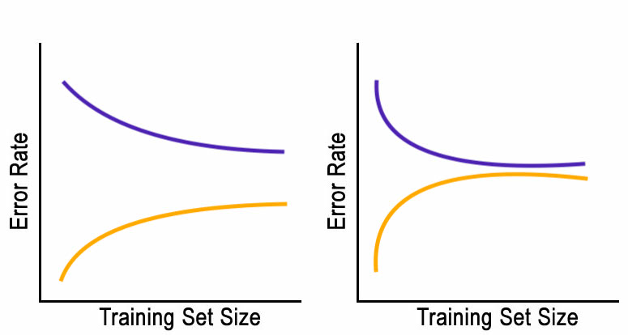
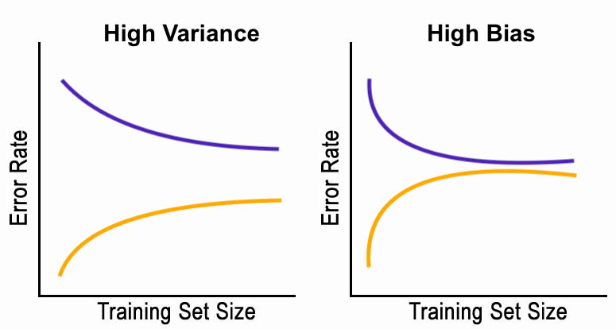
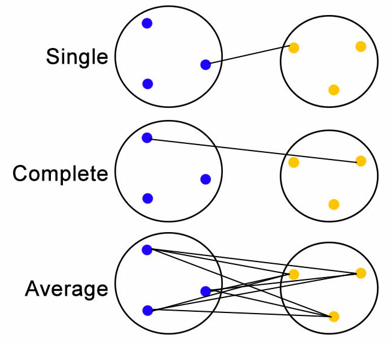
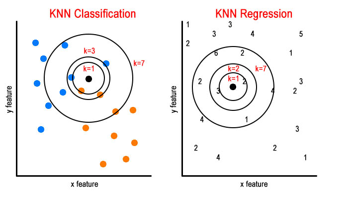
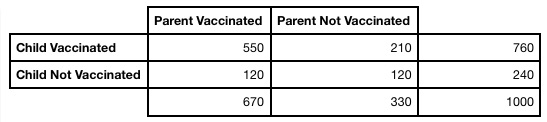

```{r setup, include=FALSE}
knitr::opts_chunk$set(echo = FALSE)
options(width = 400)
```

## Review Time! {.build}

To create this review I collected info on what the class would like to review most, and I created problems similar to those missed frequently on the previous two exams. 

I hope it's helpful!

## Topics to Cover - Reading in Data {.build}
First, let's do some data exploration to see what topics people wanted covered.
Here, data is read from a CSV file, and each value in `Topic` is split at the `;`

```{r,  echo = TRUE, error = TRUE}
dat_raw = read.csv("review_topics.csv")
topics = dat_raw[,"Topics"]
topics_matrix = sapply(topics, FUN = function(x)  strsplit(as.character(x), ";") )
```

Here's a table version of the matrix made above:
```{r, error = TRUE}
tbl = sort(table(unlist(topics_matrix)))
tbl
```

## Topics to Cover - Sideways Bar Plot {.build}

Q: How would you plot this data?

```{r,  echo = TRUE, error = TRUE, fig.height = 3.5, fig.width = 8}
par(mar=(c(4,12,2,2)))
barplot(tbl, horiz = TRUE, las=1, main="Votes for Each Topic", 
        xlab="Votes", col="blue", cex.names=0.70)
```


## System Design - Basics {.build}

Q: Describe a learning curve, and what the different parts are.

A: One line represents the error rate on the training data, the other the error rate on the test data.

The `y` axis is the error rate, and the `x` axis is the training data size.

## System Design - Recognizing Situations {.build}

Q: Which plot is high bias, and which is high variance?

```{r, error = TRUE, out.width = "800px"}

```

## System Design - Recognizing Situations

Q: Which plot is high bias, and which is high variance?

```{r, error = TRUE, out.width = "800px"}

```

## System Design - The Significance {.build}

Q: What are the significants of each situation?

High Bias:

* The error rate flattens out quickly.
* This means more training data won't help.
* More features, or better features may help.

High Variance:

* There's a large gap.
* More training data would help.
* Using fewer features can also help.

## System Design - Predicting from Car Data {.build}

Let's create a learning curve using the Iris dataset.

First, how would you create a linear model to predict pedal width?

```{r,  echo = TRUE, error = TRUE}
set.seed(150)
tr_rows = sample(1:nrow(iris), nrow(iris)*0.8, replace=FALSE)
tr_dat = iris[tr_rows,]
te_dat = iris[-tr_rows,]
fit = lm(Petal.Width ~ ., data = tr_dat)
predict = predict(fit, newdata = te_dat)
```

## System Design - Plotting Actual and Predicted {.build}

Using that model, how would you plot the expected vs predicted values, and add a line to show where predicted is equal to actual?

```{r,  echo = TRUE, error = TRUE, fig.height = 3.5}
plot(te_dat$Petal.Width, predict, main="Predicted vs. Actual Petal Width", 
     xlab="Actual", ylab="Predicted", col="blue")
abline(0,1, col="blue")
```

## System Design - Function for the Learning Curve {.build}

Q: What does this function do? Let's step through it, and see how it can help us plot a learning curve.

```{r,  echo = TRUE, error = TRUE, fig.height = 3.5}
get_error = function(size) {
  rows = sample(1:nrow(tr_dat), nrow(tr_dat)*size, replace=FALSE)
  small_tr = tr_dat[rows,]
  fit = lm(Petal.Width ~ . , data=small_tr)
  
  predict_tr = predict(fit, newdata=small_tr)
  actual_tr = small_tr$Petal.Width
  rmse_tr = sqrt(mean((actual_tr-predict_tr)^2))
  
  predict_te = predict(fit, newdata=te_dat)
  actual_te = te_dat$Petal.Width
  rmse_te = sqrt(mean((actual_te-predict_te)^2))
  
  return (c(rmse_tr, rmse_te))
}
```

## System Design - Plotting the Learning Curve {.build}

Plot a learning curve with the previous function.

```{r, echo = TRUE, error = TRUE, fig.height = 3}
result = as.data.frame(t(sapply(seq(0.1, 1, 0.1), get_error)))
plot(result$V1, ylim = c(0.1,0.25), xlab="Fraction of Training Data Used", 
     type = "l", col="blue", xaxt = "n", ylab="RMSE", main="Learning Curve, Iris Data")
axis(1, at=1:10, labels=seq(0.1, 1, 0.1))
points(result$V2, type = "l", col="orange")
legend("topright", legend=(c("Test","Training")), col=c("orange","blue"), lty=1)
```


## System Design - Interpreting the Learning Curve {.build}

```{r error = TRUE, echo = FALSE, fig.height = 3.5}
plot(result$V1, ylim = c(0.1,0.25), type = "l", col="blue", xaxt = "n", 
     xlab="Fraction of Training Data Used", ylab="RMSE", main="Learning Curve, Iris Data")
axis(1, at=1:10, labels=seq(0.1, 1, 0.1))
points(result$V2, type = "l", col="orange")
legend("topright", legend=(c("Test","Training")), col=c("orange","blue"), lty=1, inset=0.02)
```

Q: Based on the plot, what would you recommend we do to decrease the error rate?

A: To me it looks like the this is a `high variance` situation. The two lines get closer, but there's still a large gap. Getting more data could help.


## Naive Bayes - The Basic Concept {.build}

Q: Is Naive Bayes used for classification or regression?

A: It's used for classification.

The general idea is:

$$\frac{P(something)}{P(!something)} > 1$$

## Naive Bayes - Looking at Density {.build}

```{r error = TRUE, echo = TRUE, fig.height = 2.5}
plot(density(mtcars[mtcars$am == 0,]$mpg), col="red", 
     main="MPG for Automatic and Manual Cars", xlab="MPG", xlim=c(5,40))
lines(density(mtcars[mtcars$am == 1,]$mpg), col="blue")
```

Q: Can we predict whether a car is automatic or manual if we know the MPG is 25 and have a double density plot?

Q: What if we knew there were equal number of automatic and manual cars in our data?

## Naive Bayes - Equation {.build}

Let's predict whether or not a car is automatic, using whether or not the car is blue:

$$\frac{P(blue|am) P(am) }{ P(blue|!am) P(!am) } > 1$$

As in the example in the previous slide, we need to multiply by the ratio of automatic to manual cars.

## Naive Bayes - Things to Consider {.build}

Some questions to consider when using Naive Bayes:

Q: Can continuous predictors be used?

A: Yes, either by binning or by reading the value from the density function.

Q: What assumptions do we make when using Naive Bayes?

A: The predictors are conditionally independent.

Q: What assumptions do we make using NB in R?

A: The distribution is Gaussian.

Q: What other thing do we need to pay attention to, when multiplying fractions?

A: Underflow, which can be prevented by taking the logs.

## Naive Bayes - Log {.build}

"Taking the log" means we can change:

$$\frac{P(blue|am) P(am) }{ P(blue|!am) P(!am) } > 1$$

to:

$$\log\frac{P(blue|am)}{ P(blue|!am)} + \log\frac{P(am) }{P(!am)} > 0$$

to avoid underflow.

## Naive Bayes - R Example {.build}
An example in R:

```{r error = TRUE, echo = TRUE, fig.height = 3}
library(e1071)
set.seed(150)
dat = mtcars
dat$am = factor(dat$am) 
tr_rows = sample(1:nrow(dat), nrow(dat)*0.8, replace=FALSE)
tr_dat = dat[tr_rows,]
te_dat = dat[-tr_rows,]
fit = naiveBayes(am ~ . , data=tr_dat)
predicts = predict(fit, newdata=te_dat)
actuals = te_dat$am
table(predicts, actuals)
```

## Cluster Analysis - K Means {.build}

Q: Is cluster analysis supervised, or unsupervised learning?

A: It's unsupervised. This is because the clusters are not labeled. 

The steps of k-means are:

1) Randomly assign each point to a cluster.
2) Get the center of each cluster.
3) Reassign each point to the cluster that has the closest mean.
4) Repeat step two until no cluster assignment changes.

Lets draw it out!!!

Because of the random initial assignment, k-means is `non deterministic`.

## Cluster Analysis - K Means {.build}

Evaluating k-means:

TSS (Total Sum of Squares):
$$\sum[dist(point, center\ of\ all)^2]$$

BSS (Between Sum of Squares):
$$\sum[dist(cluster\ center, center\ of\ all)^2]$$

Average silhouette width:

* Value of 1 is best
* Value of 0 is worst

The distance can be calculated in multiple ways.

## Cluster Analysis - Hierarchical {.build}

Visually represented using a dendrogram.

The steps of hierarchical clustering are:

1) Join the two nearest points/clusters.
2) Repeat step 1 till there's just one cluster.
3) Decide how many clusters you want, and make a "cut".

## Cluster Analysis - Hierarchical R Example {.build}

```{r error = TRUE, echo = TRUE, fig.height = 4.5}
dend = hclust(dist(mtcars), method="complete")
plot(dend, main="MT Cars Clusters", xlab="Make and Model")
```

## Cluster Analysis - Hierarchical "Closeness" {.build}

Q: What are some ways to define how close two clusters are?

Let's draw them out!

1) Complete: longest distance, between the furthest points.
2) Average: average of the distance from each point to every other.
3) Single: shortest distance, between the closest points.

## Cluster Analysis - Hierarchical "Closeness" {.build}

The different types of linkage:

```{r, error = TRUE, out.width = "550px"}

```

## Decision Trees - Basics {.build}

In a decision tree, we have decision boundaries that separate the data.

At each node, just ONE feature is used to split the data.

Are decision trees used for classification or regression?

<center><strong style="color: red; font-size: 90px">Both!</strong></center>

Decision trees give specific values at each leaf node when used for regression.

Q: When do we stop splitting? Why not make every training example a leaf node?

A: To avoid overfitting.

## Decision Trees - A Simple Example {.build}

```{r error = TRUE, echo = TRUE}
library(rpart)
library(rpart.plot)
fit = rpart(cyl ~ . , data=mtcars, method="class")
prp(fit, varlen=-10, box.col=c("red", "orange", "yellow")[fit$frame$yval], main="Num. of Cylinders")
```

## Decision Trees - Evaluating {.build}

Q: How are splits determined?

Purity ranges from 0 to 0.5 and 0 is the best.

Write an R function to calculate the Gini index, and use it to get the Gini index at a node for which the minority class in a node represents 25% of the data at a node.

```{r error = TRUE, echo = TRUE}
get_gini = function(p) { 2 * (p * (1 - p)) }
get_gini(0.75)
```

Gini index is calculated:

$$2 * (p * (1 – p))$$

## Logistic Regression - Basics {.build}

Q: Is logistic regression used for classification or regression?

<center><strong style="color: red; font-size: 80px">Classification!</strong></center>

A: Logistic regression is a way we can use linear regression for classification.

Q: Is logistic regression parametric, or non-parametric? 

A: It's parametric. The parameters are the coefficients of the linear model.

Q: How is a logistic regression model trained?

A: When training a logistic regression model, we use the maximum likelihood principal. That is, we need to use the coefficients that maximize the likelihood of getting the output we know we should be getting.

## Logistic Regression - Predicting with R {.build}

How wold you predict `am` of `mtcars` using all features?

```{r error = TRUE, echo = TRUE}
fit = glm(am ~ cyl , data=mtcars, family="binomial")
thresh = 0.5
predicts = ifelse(predict(fit) >= thresh, 1, 0)
predicts
```

## Logistic Regression - Confusion Matrix {.build}

Create a confusion matrix of predicted and actual values. `1` is manual and `0` is automatic.

```{r error = TRUE, echo = TRUE}
actuals = mtcars$am
table(predicts, actuals)
```

Q: What's the true positive rate?

A: `8` because out of the 13 actually manual cars, we predicted 8 to be manual.

Q: What's the false negative rate?

A: `3` because out of the 19 actually automatic cars, we predicted 3 to be manual.

## Logistic Regression - Precision and Recall {.build}

What is precision and recall?

$$precision = \frac{true\ positive}{true\ positive + false\ positive}$$ 

$$recall = \frac{true\ positive}{true\ positive + false\ negative}$$ 

In other words:

* Precision is the proportion of positive predictions that were actually positive.
* Recall is the the proportion of the actual positives that we correctly predicted as positive.

When might these be useful?

## KNN - Basics {.build}

Q: Is KNN used for classification or regression?

<center><strong style="color: red; font-size: 60px">Both!</strong></center>

A: It's also used for anomaly detection.

Q: How long does it take to train a KNN model?

A: It doesn't take any time. All the model has to do is remember the data. 
Making predictions on the other hand can take a long time, as distances are calculated for each point.

Q: What are the hyperparameters for KNN? Hint: for KNN anomaly detection there are three.

A: Hyperparameters are k, the distance function being used, and for anomaly 
detection the distance threshold at which you consider a point an anomaly.

## KNN - Classification and Regression {.build}

Using the image below, let's classify a point, and find the value for a point.

```{r, error=TRUE, out.width="550px"}

```

* Classification the point is set to the majority class of the k nearest neighbors.
* In KNN regression the new point is set to the mean of the k nearest neighbors.

## KNN - More Stuff {.build}

Q: What threshold is used to determine whether or not a point is an anomaly in KNN anomaly detection?

A: It depends on the data, the threshold is a hyperparameter.

Q: How should I change the hyperparameter K to increase model flexibility?

A: By decreasing K, we are looking at fewer neighbors, and this increases the flexibility of our model.
This can, though, lead to overfitting.

## Aggregation in R - Basics {.build}

In R, aggregation is a way of taking multiple values, and gettin one value.

Can you name a few R functions that aggregate data?

Here are some examples:

```{r error = TRUE, echo = TRUE}
sum(1:100)
mean(0:100)
```

## Aggregation in R - The Aggregate Function {.build}

How would you find the mean `mpg` for each `cyl` value in the `mtcars` data?

```{r error = TRUE, echo = TRUE}
aggregate(mpg ~ cyl, data=mtcars, mean)
```

This results in a table with columns `cyl` and `mpg` and a row for each `cyl` value.

I think of the `~` symbol as meaning "for each" like in this case, we are getting the mean `mpg` "for each" `cyl`.

## Aggregation in R - The Table Function {.build}

If we just want to count the occurrences in each category, we can use the `table()` function. Create a table of `cyl` values, and plot it using a bar plot?

```{r error = TRUE, echo = TRUE}
barplot(table(mtcars$cyl), main="Car Counts by Cylinder Number", xlab="Num. of Cylinders")
```

## Linear Regression - Basics {.build}

Q: Is linear regression used to find a category, or a numerical value?

A: It's used for regression, which means the output value is numeric.

Q: Is linear regression a parametric or non-parametric model?

A: It's parametric, the parameters are...

   The coefficients which are the slope and the intercepts.

Q: How fast is it to make predictions with linear regression?

A: It's very fast, the coefficient values simply get plugged in to the equation of the linear model.

Q: How is a linear model trained?

A: The coefficients are tuned to minimize the error rate of the model until the minimum error is reached.

## Linear Regression - Example in R {.build}

How would you create a linear model in R using the `iris` data?
Plot the predicted vs. actual.

```{r error = TRUE, echo = TRUE, fig.height = 3}
tr_rows = sample(1:nrow(iris), nrow(iris)*0.8, replace=FALSE)
fit = lm(Petal.Length ~ . , data=iris[tr_rows,])
predict = predict(fit, newdata=iris[-tr_rows,])
plot(iris[-tr_rows,]$Petal.Length, predict, xlab="Actual", ylab="Predicted", main="Predicting Petal Length")
abline(0,1)
```

## Conditional Probability - Basics {.build}

Conditional probability is the probability of something, given something else.

Q: What's the probability of rolling higher than a 4, given you rolled higher than a 3?

A: `2/3` because there are 3 possibilities higher than 3 (4, 5, and 6) and of those, 2 are higher than 4.

In conditional probability, we limit our scope to the given condition.

## Conditional Probability - Prob. Table {.build}

```{r, error=TRUE, out.width="550px"}

```

Q: What's the probability that a child is vaccinated, given that the parent is not?

A: 0.7 - The given condition (parent not vaccinated) has 330 occurrences, of which in 210 cases the child is vaccinated. 210 / 330 = .7

Q: What's the probability that a parent is vaccinated, given that the child is not?

A: 0.5 - The condition (child not vaccinated) has 240 occurrences, and of those 120 are cases where the parent is vaccinated.

## Expectation - Basics {.build}

Given these vectors of outcomes and probabilities...

```{r, error=TRUE, echo=TRUE}
outcome = 2:6
probs = c(1/8,1/4,1/4,1/4,1/8)
```

Write some R code to calculate the expected value.

```{r, error=TRUE, echo=TRUE}
exp = sum(outcome*probs)
exp
```

## Expectation - Variance and Standard Deviation {.build}

Given the vectors and expectation from the previous slide, calculate the variance and the standard deviation.

```{r, error=TRUE, echo=TRUE}
var = sum(probs*((outcome-exp)^2))
var
sd = sqrt(var)
sd
```

## Expectation - Dice Problem {.build}

Write R code that simulates the sum of rolling three dice, 1000 times.

```{r, error=TRUE, echo=TRUE}
rolls = sample(1:6, 1000, replace=TRUE) + sample(1:6, 1000, replace=TRUE) + sample(1:6, 1000, replace=TRUE)
head(rolls, 20)
rolls = replicate(1000, sum(replicate(3, sample(0:6, 1))))
head(rolls, 20)
```

## Expectation - Dice Problem Variance {.build}

Calculate the variance and standard deviation of the dice rolls simulated on the previous slide.

```{r, error=TRUE, echo=TRUE}
exp = mean(rolls)
var = sum((rolls-exp)^2/1000)
var
sd = sqrt(var)
sd
```

# Question Time!
